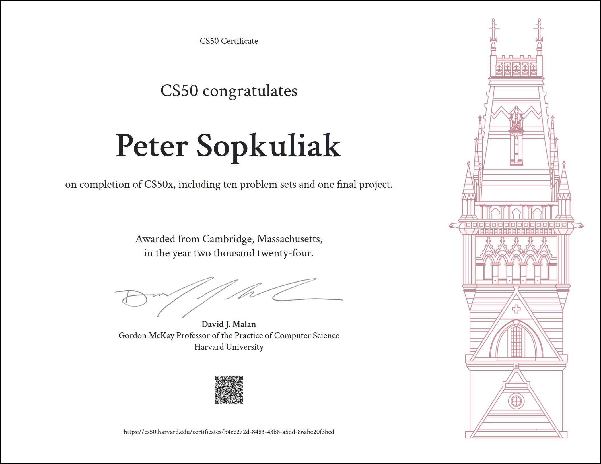
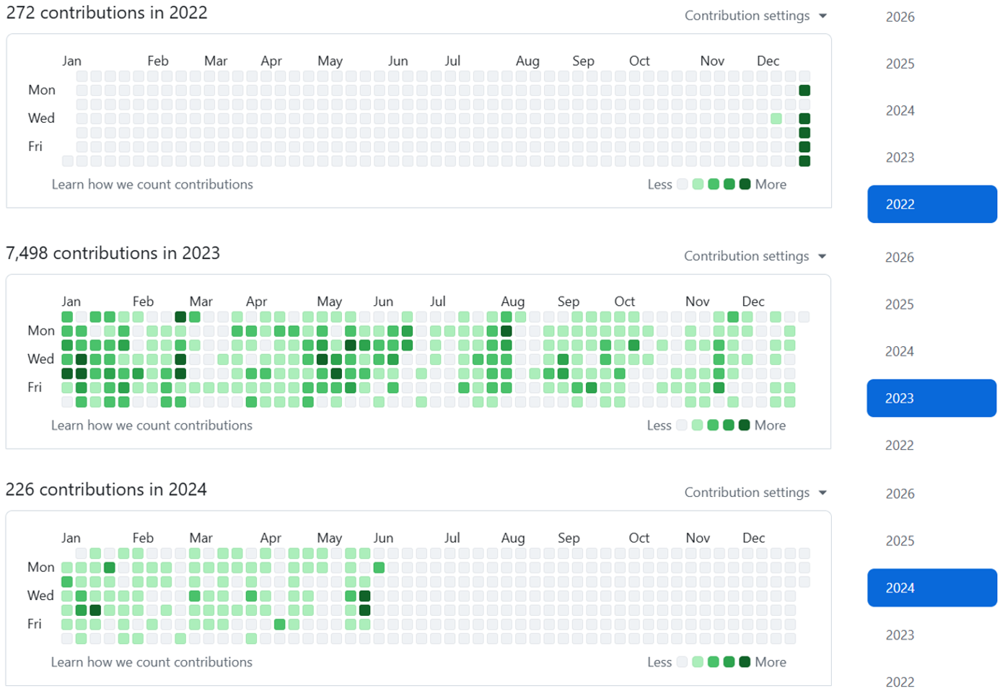
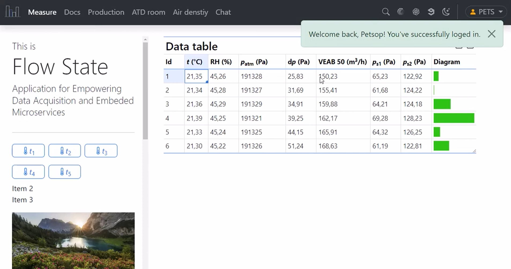
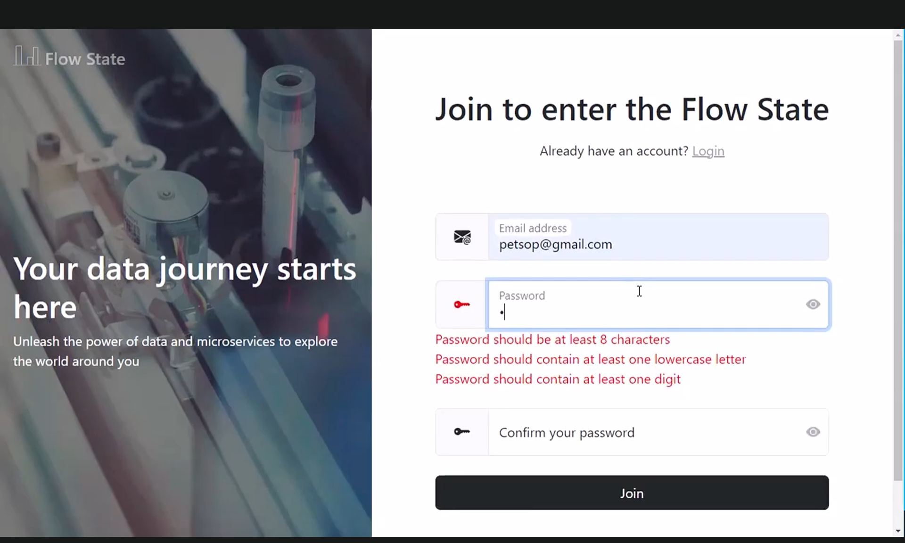
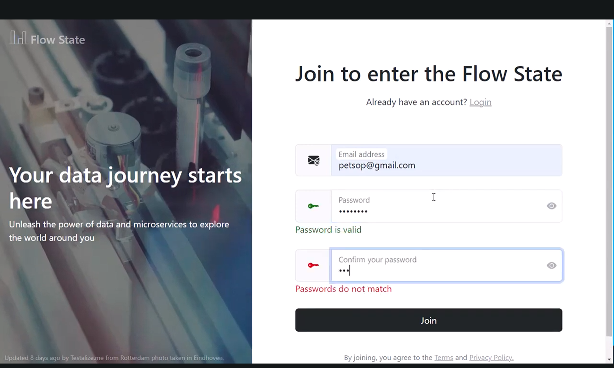
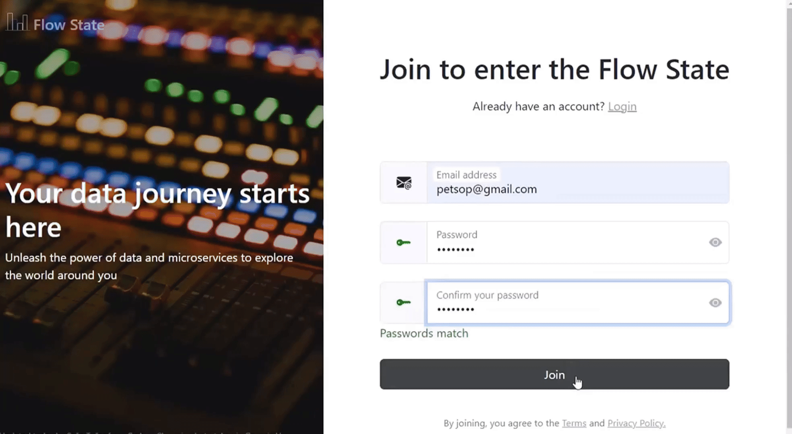
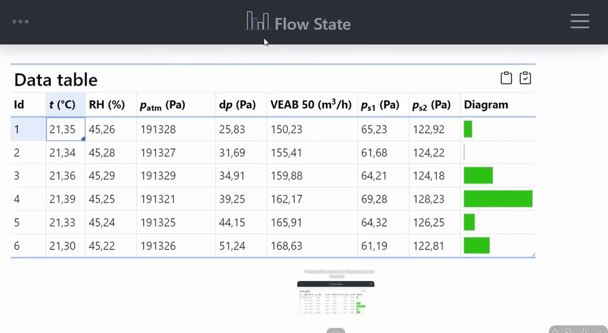
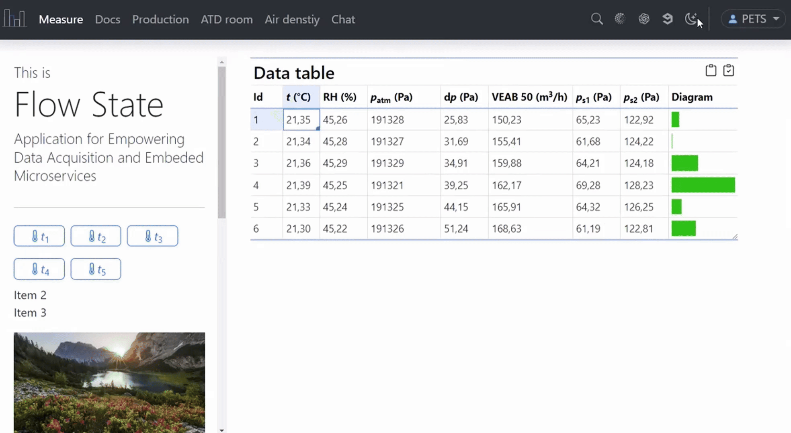
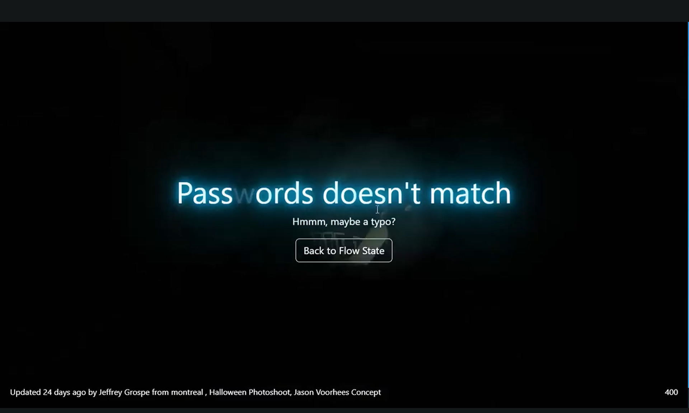

  

# CS50x – Introduction to Computer Science

Harvard University | David J. Malan

Completed by Peter Sopkuliak | Course Duration: December 2022 – June 2024

[🧪 Labs](./labs) | [📚 Problem Sets](./problem-sets) | [📖 Final Project Documentation](./project/README.md) | [🎥 Video Presentation](https://youtu.be/JRIY7zJE98Y)

This repository contains all completed CS50x labs, problem sets, and the final project submitted as part of Harvard University's CS50x course.

## Certificate of Completion

## What is CS50x?

CS50x is Harvard University's flagship introduction to computer science.

The course covers:

- Algorithms
- Data structures
- Memory management
- C programming
- Python
- SQL
- Web development
- JavaScript
- Flask
- Software engineering principles

The course was completed independently alongside full-time employment and additional CS50 courses.

## Learning Journey

Flow State represents the culmination of approximately 18 months of continuous learning, experimentation, and software development alongside full-time employment.

## Harvard CS50x Final Project

Flow State is a web application focused on interactive data management, sensor organization, and visual workflows, developed as the capstone project for Harvard University's CS50x course.

The project combines concepts learned throughout the course, including programming, databases, web development, user authentication, API integration, and responsive user interface design.

## Project Highlights

- User Authentication & Email Verification
- Responsive Light/Dark Theme
- Interactive Drag & Drop Dashboard
- Persistent User Preferences
- Dynamic API-Driven Content
- SQLite Database Backend
- Custom UI Animations

## Authentication & Security

Features:

- User Registration
- Login
- Password Validation
- Email Verification
- Session Management
- User Settings

### Login Screen

### Password Validation

### Authentication Workflow

User registration, validation, email verification, and login process.

## User Experience & Responsive Design

One of the key goals of the project was to create a responsive and interactive user interface.

Features:

- Responsive Layout
- Adaptive Navigation
- Animated Components
- Dynamic Side Panels
- Personalized User Preferences

### Responsive User Interface

The application dynamically adapts to different screen sizes and device layouts. Navigation panels automatically collapse and expand while maintaining usability and visual consistency.

### Theme Personalization

Users can switch between light and dark themes. Preferences are stored in the database and automatically restored after login.

## Interactive Dashboard

The dashboard allows users to create and organize data structures using drag-and-drop interactions.

Features:

- Dynamic Table Creation
- Sensor Management
- Column Grouping
- Visual Drop Indicators
- Interactive Animations

### Dashboard Overview

### Interactive Dashboard Demonstration

Users can drag sensors from the navigation panel directly into tables, dynamically creating and organizing data structures.

## Error Handling & User Feedback

Special attention was given to user experience and visual feedback.

The application contains a custom horror-themed error page where:

- Background images are dynamically loaded through an API
- Every visit can display different content
- Mouse movement acts as a flashlight revealing the scene
- Animated effects guide the user's attention

### Error Handling

## Dynamic Content Experience

The application also experiments with visual storytelling techniques and advanced content presentation.

### Parallax Content Experience

Interactive content presentation using layered scrolling effects.

Features:

* Layered scrolling
* Dynamic imagery
* Enhanced user immersion
* Improved visual presentation of content

## Technical Stack

| Area | Technologies |
|------|-------------|
| **Programming Languages**  | Python, JavaScript, SQL                                                                   |
| **Backend**                | Flask, SQLite                                                                             |
| **Frontend**               | HTML, CSS, Bootstrap                                                                      |
| **Interactive Components** | Tabulator, Interact.js, Anime.js                                                          |
| **Integrations**           | Unsplash API, Email Validator, Email Verification                                                       |
| **Concepts Applied**       | Authentication, Responsive Design, Drag & Drop UI, Session Management |

## Skills & Experience Gained

Through the development of Flow State, I gained hands-on experience with:

- Designing and developing full-stack web applications
- Building Flask-based backend architectures
- Designing and managing SQLite databases
- Implementing authentication and authorization workflows
- Integrating third-party APIs and external services
- Creating responsive and interactive user interfaces
- Managing user preferences and session persistence
- Combining frontend and backend technologies into a cohesive application

## Future Development

Flow State is planned to evolve into a complete IoT and data management platform capable of:

- Arduino Integration
- MQTT Communication
- Sensor Connectivity
- Real-Time Dashboards
- Data Analytics
- Industrial Monitoring

Potential future integrations include Arduino-based sensor networks, MQTT brokers, and real-time visualization dashboards for engineering and industrial environments.

## Looking Back

Flow State served as a foundation for several later projects involving data analytics, database design, process automation, and operational risk management.

Many of the concepts first explored during CS50x were later expanded in projects such as RiskPulse and other data-focused applications.
